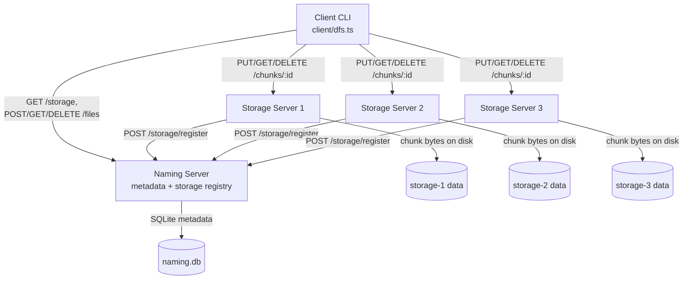
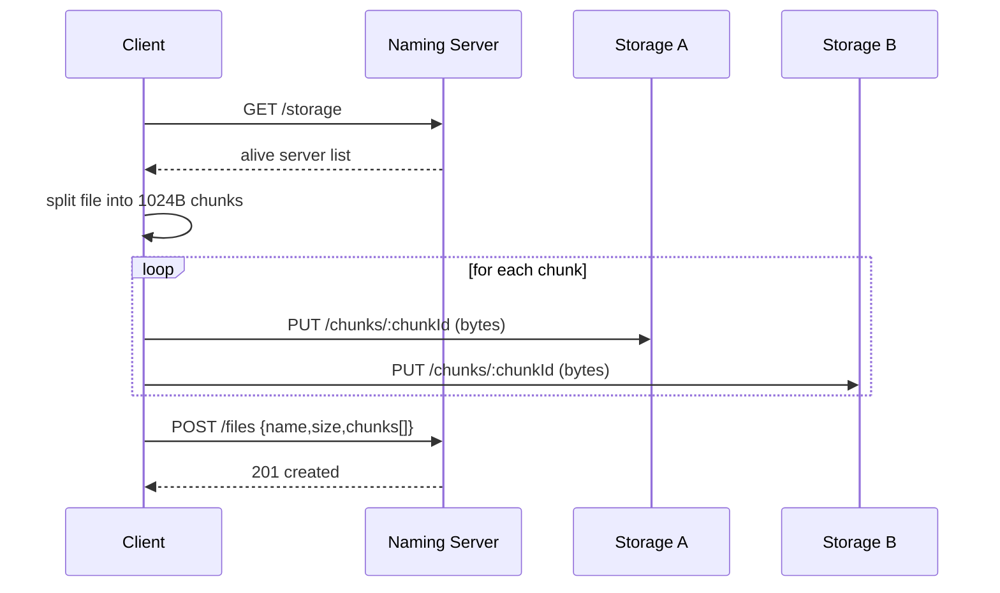
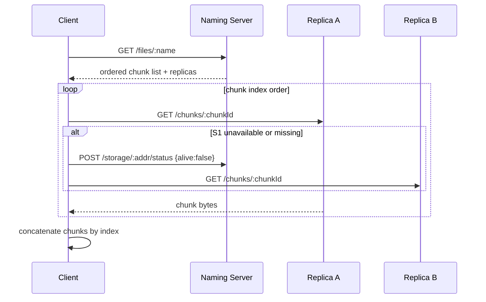
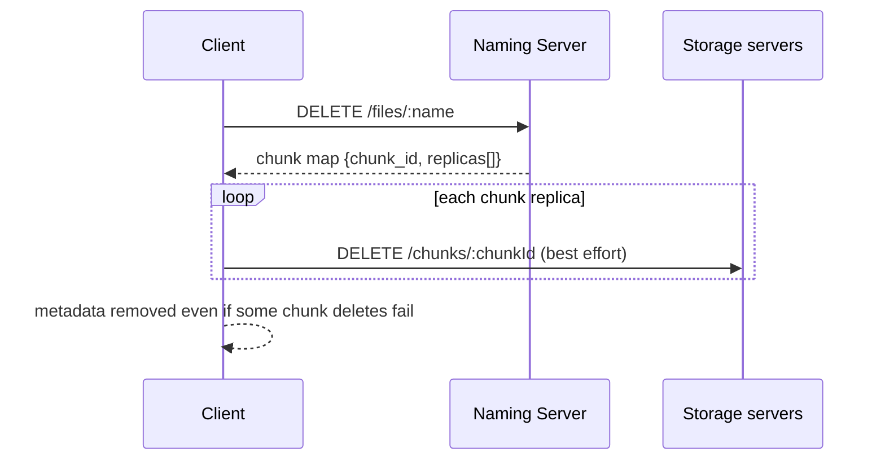
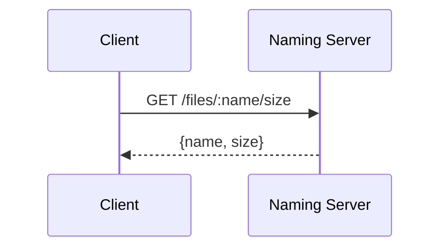

# Distributed File System Architecture

This document is the architecture deliverable for the project. It covers system
topology, operation flows, design decisions, and fault-tolerance behavior.

## 1) System Diagram

## 2) Operation Flows

### Create

### Read

### Delete

### Size

## 3) Design Decisions and Trade-offs

### Single naming server

- Decision: one metadata authority keeps the model simple and consistent.
- Benefit: easy implementation, deterministic file/chunk mapping, small API surface.
- Trade-off: naming server is a single point of failure for control-plane operations.

### Naming server stores metadata only

- Decision: chunk bytes never go through naming server.
- Benefit: lower load on naming server, clean separation of metadata/data planes.
- Trade-off: client must coordinate uploads/downloads and handle replica fallback logic.

### Client-driven replication and failover

- Decision: client writes each chunk to multiple storage servers and retries reads across replicas.
- Benefit: read availability with storage failures and simple server-side behavior.
- Trade-off: more complexity in client and best-effort delete semantics.

### Fixed chunk size (1024B) and replication target (2)

- Decision: deterministic chunking and minimum two copies per chunk.
- Benefit: straightforward reassembly and predictable replication behavior.
- Trade-off: small chunk size increases metadata overhead; replication factor 2 limits failure tolerance.

## 4) Fault-Tolerance Analysis

### What happens if a storage server goes down?

- Reads can still succeed if another replica of each chunk is reachable.
- The client tries next replicas and reports failed nodes to naming server.
- System remains available for files whose chunks still have at least one reachable copy.

### What happens if the naming server goes down?

- Naming server is currently a SPOF for metadata operations.
- No create/read(size+metadata)/delete can proceed while it is unavailable.
- Existing chunk bytes on storage remain on disk, but are not discoverable through normal client flow.

### How many simultaneous failures can the system survive?

- With replication factor 2, each chunk can tolerate loss of one replica holder.
- The system can survive multiple server failures only if every chunk still has at least one live replica.
- If both replicas for any chunk are unavailable/lost, the containing file becomes unreadable.

### Recoverable vs data-loss/unavailability failures

| Failure type | Recoverable? | Impact |
| --- | --- | --- |
| Single storage process crash/network issue | Yes | Temporary degradation; reads usually continue via replica |
| Single storage disk loss (with other replica alive) | Partly | File still readable; redundancy reduced until repaired |
| Loss of both replicas of one chunk | No (without external backup) | Data loss for that chunk/file |
| Naming server process outage | Yes (after restart) | Full control-plane unavailability during outage |
| Naming DB corruption/loss without backup | No | Metadata loss; files become undiscoverable |

## 5) Verification Reference

Integration behavior described here is exercised by owner-scoped end-to-end suites:

- `test/e2e.client.integration.test.ts`
- `test/e2e.naming.integration.test.ts`
- `test/e2e.storage.integration.test.ts`

Findings log: `test/INTEGRATION_BUG_REPORT.md`.
